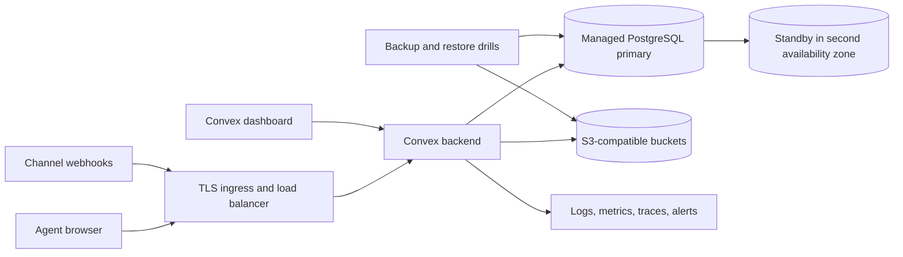

# Convex Cloud vs self-hosted Convex with S3-compatible storage

Research date: 2026-08-12  
Use case: omnichannel CRM with 30, 100, 300, or 1,000 concurrently active human support agents  
Currency: USD per month, US region pricing unless stated otherwise

## Executive conclusion

Convex Cloud Professional is the lower-risk and usually lower-TCO choice for 30-300 concurrent agents. Under the explicit base workload below, its estimated monthly bill is about **$133, $247, and $633** at 30, 100, and 300 active agents. The corresponding illustrative self-hosted infrastructure is about **$261, $489, and $979** before labor, or **$1,461, $2,289, and $3,979** after including a modest operations allocation.

At 1,000 active agents, Cloud Professional is still within its published 10,000 concurrent-session limit, but its modeled usage bill reaches about **$2,078/month**. Convex Business begins at a **$2,500 monthly minimum** and is the cloud tier that adds a contractual service SLA. The self-hosted infrastructure illustration is about **$2,141/month before labor** and **$8,141/month with 0.5 operations FTE**. A real benchmark can move these figures materially.

The strongest reasons to self-host are not raw object-storage savings. They are control of deployment location, data residency, private networking, and existing platform-operations capability. This matters in Indonesia because Convex Cloud currently documents only **US East (Virginia)** and **EU West (Ireland)** regions, while a self-hosted stack can be placed nearer users. [Convex regions](https://docs.convex.dev/production/regions)

The most important architecture correction is that **S3 is not the primary database for self-hosted Convex**. The database is SQLite, PostgreSQL, or MySQL. S3-compatible storage holds exports, snapshot imports, modules, user files, and search indexes. Convex recommends managed PostgreSQL or MySQL for production workloads needing guaranteed uptime. [Self-host README](https://github.com/get-convex/convex-backend/blob/main/self-hosted/README.md), [PostgreSQL/MySQL guide](https://github.com/get-convex/convex-backend/blob/main/self-hosted/advanced/postgres_or_mysql.md), [S3 guide](https://github.com/get-convex/convex-backend/blob/main/self-hosted/advanced/s3_storage.md)

## Decision table

| Criterion | Convex Cloud Professional | Convex Cloud Business | Self-hosted Convex + PostgreSQL + S3-compatible storage |
|---|---:|---:|---|
| Published base price | $25/developer/month | $2,500/month minimum | No Convex license fee stated; infrastructure and labor are yours |
| CRM agents billed as seats | No | No | No |
| Concurrent sessions | 10,000 on S256 | 1,000-200,000 depending on S16/S256/D1024/D2048 | No comparable published capacity; benchmark your hardware |
| Concurrent queries | 256 on S256 | 16/256/1,024/2,048 by class | Tunable, but Convex warns excessive concurrency eventually degrades performance |
| Service SLA | No contractual SLA in pricing matrix | 99.9% serverless, 99.95% dedicated | Whatever the operator and infrastructure providers can deliver |
| Backups | Daily backups included | Logical or high-speed physical by class | Operator-owned database backups plus Convex exports/snapshots |
| Observability | Health dashboard; Pro includes log streaming and exception reporting | Pro features plus enterprise capabilities | Deploy, secure, retain, and alert on logs/metrics yourself |
| Data regions | Virginia or Ireland | Virginia or Ireland; BYOC listed for Enterprise | Operator-selected region |
| S3-compatible object storage | Managed Convex file storage | Managed Convex file storage | Five buckets and credentials configured by operator |
| Authentication caveat | Managed product behavior | Managed product behavior | Convex Auth manual setup; CLI does not support self-hosted Auth yet |
| Upgrade responsibility | Convex | Convex | Operator; exports recommended before upgrade and fallback may require downtime |
| Scaling confidence | Cloud is documented as optimized for scale | Dedicated classes and support options | Official docs say self-host supports free-tier features; capacity must be load-tested |

Sources: [Convex pricing](https://www.convex.dev/pricing), [Business pricing](https://www.convex.dev/enterprise/pricing), [limits](https://docs.convex.dev/production/state/limits), [self-host README](https://github.com/get-convex/convex-backend/blob/main/self-hosted/README.md), [self-host tuning](https://github.com/get-convex/convex-backend/blob/main/self-hosted/advanced/knobs.md), [upgrades](https://github.com/get-convex/convex-backend/blob/main/self-hosted/advanced/upgrading.md).

## Official Convex Cloud prices

These are quoted prices, not estimates. Professional costs **$25 per developer per month**, supports 1-20 developers, and includes log streaming, exception reporting, daily backups, custom domains, compliance reports, and email support. Business has a **$2,500 monthly minimum**, includes 1-50 developers without a per-developer fee, and adds SAML/SSO, dedicated databases, and service SLAs. [Convex pricing](https://www.convex.dev/pricing), [Business pricing](https://www.convex.dev/enterprise/pricing)

| Meter, US region | Starter included / overage | Professional included / overage |
|---|---:|---:|
| Function calls | 1M / $2.20 per additional 1M | 25M / $2 per additional 1M |
| Action compute | 20 GB-hours / $0.33 per additional GB-hour | 250 GB-hours / $0.30 per additional GB-hour |
| Database storage | 0.5 GB / $0.22 per additional GB-month | 50 GB / $0.20 per additional GB-month |
| Database I/O | 1 GB / $0.22 per additional GB | 50 GB / $0.20 per additional GB |
| File storage | 1 GB / $0.033 per additional GB-month | 100 GB / $0.03 per additional GB-month |
| Search storage | 0.5 GB / $0.55 per additional GB-month | 1 GB / $0.50 per additional GB-month |
| Search queries | 3,000 query-GB / $0.11 per additional 1,000 | 50,000 query-GB / $0.10 per additional 1,000 |
| Data egress | 1 GB / $0.132 per additional GB | 50 GB / $0.12 per additional GB |

EU region usage is priced at 1.3 times the quoted US rates. Limits and included amounts are measured per Convex team rather than per project. [Convex limits](https://docs.convex.dev/production/state/limits), [pricing FAQ](https://www.convex.dev/pricing/faq)

Function-call billing is particularly important for realtime CRM use. It counts explicit client calls, scheduled executions, subscription updates, and file accesses. Seat count alone is therefore not a cost driver. The material variable is how often dependencies change and cause each subscribed query to update. [Convex limits](https://docs.convex.dev/production/state/limits), [realtime documentation](https://docs.convex.dev/realtime)

## Published cloud capacity

| Deployment class | Plan access | Concurrent sessions | Queries | Mutations | Convex/HTTP actions | Node actions | Max dataset |
|---|---|---:|---:|---:|---:|---:|---:|
| S16 | Free, Starter, Business, Enterprise | 1,000 | 16 | 16 | 64 | 64 | 1 TB |
| S256 | Professional, Business, Enterprise | 10,000 | 256 | 256 | 512 | 256 | 1 TB |
| D1024 | Business, Enterprise | 100,000 | 1,024 | 512 | 1,024 | 1,024 | 4 TB |
| D2048 | Business, Enterprise | 200,000 | 2,048 | 1,024 | 2,048 | 2,048 | 8 TB |

One thousand active agents sit exactly at S16's session ceiling, leaving no headroom for supervisors, multiple tabs, reconnect overlap, integrations, or customer-facing sessions. Professional S256 has 10 times the requested session capacity. A session is not the same as a query executing at that instant, so concurrent agents cannot be mapped directly to concurrent-query demand. [Convex limits](https://docs.convex.dev/production/state/limits)

Convex says cloud deployments target 99.99% availability, but the Professional pricing matrix does not provide a service SLA. Business/Enterprise publish 99.9% for S16/S256 and 99.95% for D1024/D2048. Cloud data is encrypted at rest, replicated across availability zones, and backed up incrementally; these are platform guarantees, not proof that an application meets its own recovery objectives. [Status and guarantees](https://docs.convex.dev/production/state), [Business pricing](https://www.convex.dev/enterprise/pricing)

## Transparent workload model

No official Convex benchmark maps “human CRM agent” to calls, I/O, or compute. The estimates below are scenario math and must be replaced with telemetry from a prototype.

Base assumptions per concurrently active agent:

| Assumption | Value | Reason for modeling |
|---|---:|---|
| Active time | 8 hours/day, 22 days/month | Staffed contact-center month |
| Billable subscription updates | 1 per active second in aggregate | Represents inbox, assignment, presence, customer, and SLA views after dependency invalidations; not an official benchmark |
| Calls/month | 633,600 per agent | `8 * 3,600 * 22 * 1` |
| Database I/O | 0.5 GB/month | Illustrative indexed CRM reads/writes after caching |
| Database storage | 0.2 GB retained | Contacts, conversations, events, indexes; excludes attachments |
| File storage | 2 GB retained | Attachments and channel media |
| File/data egress | 4 GB/month | Attachment viewing, exports, fetches, and log streams |
| Search storage | 0.02 GB | Searchable conversation/contact material |
| Action compute | 0.5 GB-hour/month | Webhooks, channel APIs, workflow jobs |
| Professional developer seats | 5 | Fixed application team for comparability |

The model does not include WhatsApp, Meta, email, SMS, telephony, LLM, CDN, frontend hosting, analytics warehouse, or customer-support labor charges because they are common to both deployment choices or depend on external vendors.

## Calculated Convex Cloud estimate

All numbers in this section are calculations from the assumptions above and the official rate card. They are not quotes from Convex.

| Concurrent active agents | Calls/month | Pro base, 5 devs | Call overage | Other usage overage | Estimated Pro total |
|---:|---:|---:|---:|---:|---:|
| 30 | 19.01M | $125.00 | $0.00 | $8.40 | **$133.40** |
| 100 | 63.36M | $125.00 | $76.72 | $45.50 | **$247.22** |
| 300 | 190.08M | $125.00 | $330.16 | $177.50 | **$632.66** |
| 1,000 | 633.60M | $125.00 | $1,217.20 | $735.50 | **$2,077.70** |

“Other usage” includes modeled action compute, database storage/I/O, file/search storage, and egress after Professional included amounts. Search-query usage is omitted because query-GB depends on index size and query behavior; add it after measurement.

Sensitivity is dominated by subscription updates:

| Aggregate subscription updates per active agent-second | 30 agents, calls/mo | 300 agents, calls/mo | 1,000 agents, calls/mo | Pro call charge at 1,000 agents |
|---:|---:|---:|---:|---:|
| 0.25 | 4.75M | 47.52M | 158.40M | $266.80 |
| 1.00, base case | 19.01M | 190.08M | 633.60M | $1,217.20 |
| 4.00 | 76.03M | 760.32M | 2,534.40M | $5,018.80 |

The correct validation exercise is to instrument realistic subscriptions and mutation fanout, then inspect Convex usage rather than multiplying seats by an assumed fixed bill.

## Self-host architecture and requirements

Convex documents three services for self-hosting: the Convex backend, the dashboard, and the frontend application. The backend listens on 3210, HTTP actions on 3211, and the dashboard on 6791. Routing, TLS, firewalling, secret handling, deployment automation, monitoring, and recovery are operator responsibilities. [Self-host README](https://github.com/get-convex/convex-backend/blob/main/self-hosted/README.md)

For production uptime, Convex says it is likely preferable to use managed PostgreSQL or MySQL instead of default local SQLite. Convex has tested PostgreSQL 17 and MySQL 8. The backend and database should be in the same region and as close as possible because database latency negatively affects query performance. [PostgreSQL/MySQL guide](https://github.com/get-convex/convex-backend/blob/main/self-hosted/advanced/postgres_or_mysql.md)

S3 mode requires AWS region/key/secret variables plus five bucket variables:

- `S3_STORAGE_EXPORTS_BUCKET`
- `S3_STORAGE_SNAPSHOT_IMPORTS_BUCKET`
- `S3_STORAGE_MODULES_BUCKET`
- `S3_STORAGE_FILES_BUCKET`
- `S3_STORAGE_SEARCH_BUCKET`

`S3_ENDPOINT_URL` is required for R2 and other S3-compatible replacements. The official guide does not prescribe versioning, encryption keys, retention policies, replication, least-privilege IAM, malware scanning, or lifecycle policy. Those are production design decisions. Switching between local and S3 storage requires an export, a fresh backend, and `import --replace-all`. [S3 guide](https://github.com/get-convex/convex-backend/blob/main/self-hosted/advanced/s3_storage.md)

Cloudflare R2 is used for the illustration because Convex explicitly supports an alternative S3 endpoint. R2 Standard currently charges $0.015/GB-month, $4.50/million Class A operations, $0.36/million Class B operations, and no Internet egress fee; it includes 10 GB storage, 1M Class A, and 10M Class B per month. These are official R2 rates, not Convex rates. [R2 pricing](https://developers.cloudflare.com/r2/pricing/)

## Illustrative self-hosted cost model

This is a planning envelope, not a sizing recommendation. There is no official published mapping between self-host hardware and S16/S256. Convex explicitly directs operators to its open-source LoadGenerator and says concurrency knobs must be tuned to hardware and workload. [Benchmarking guide](https://github.com/get-convex/convex-backend/blob/main/self-hosted/advanced/benchmarking.md), [tuning guide](https://github.com/get-convex/convex-backend/blob/main/self-hosted/advanced/knobs.md)

To keep the assumptions auditable, compute and database prices use public Amazon Lightsail fixed-price bundles. Two backend instances are budgeted, but this is **not a claim that two Convex backend containers form a supported active-active cluster**. Validate topology and failover behavior before relying on it. Lightsail publishes Linux VM bundles from $44/month for 2 vCPU/8 GB through $384/month for 16 vCPU/64 GB. Its HA PostgreSQL bundles range from $120/month for 2 cores/4 GB through $980/month for 8 cores/32 GB, and the HA plan adds a synchronously replicated standby in another availability zone. [Lightsail pricing](https://aws.amazon.com/lightsail/pricing/), [Lightsail database HA](https://docs.aws.amazon.com/lightsail/latest/userguide/amazon-lightsail-faq-databases.html)

| Concurrent agents | Backend envelope | HA database | LB/TLS | R2 estimate | Backups/tools | Observability | Infra subtotal |
|---:|---:|---:|---:|---:|---:|---:|---:|
| 30 | 2 x 2 vCPU/8 GB = $88 | 2 core/4 GB = $120 | $18 | $0 | $5 | $30 | **$261** |
| 100 | 2 x 4 vCPU/16 GB = $168 | 2 core/8 GB = $230 | $18 | $3 | $10 | $60 | **$489** |
| 300 | 2 x 8 vCPU/32 GB = $328 | 4 core/16 GB = $490 | $18 | $18 | $25 | $100 | **$979** |
| 1,000 | 2 x 16 vCPU/64 GB = $768 | 8 core/32 GB = $980 | $18 | $65 | $60 | $250 | **$2,141** |

R2 estimates assume 2 GB retained files per agent, 5,000 writes and 100,000 reads per agent-month, then apply the R2 free tier and billing-unit rounding approximately. “Backups/tools” and “observability” are explicit allowances, not vendor quotes. They cover export retention, restore drills, metrics, log storage, alerting, and incident tooling. Cross-region database backups, WAF, NAT, secrets/KMS, vulnerability scanning, staging, CI runners, and network overages may add cost.

Engineering labor usually decides the TCO. The following uses a stated loaded platform-engineer cost of **$12,000/month**:

| Concurrent agents | Infra subtotal | Ops allocation | Labor | Estimated self-host TCO |
|---:|---:|---:|---:|---:|
| 30 | $261 | 0.10 FTE | $1,200 | **$1,461** |
| 100 | $489 | 0.15 FTE | $1,800 | **$2,289** |
| 300 | $979 | 0.25 FTE | $3,000 | **$3,979** |
| 1,000 | $2,141 | 0.50 FTE | $6,000 | **$8,141** |

This excludes initial migration/build effort. If an existing platform team can absorb the work at near-zero incremental labor, compare the infrastructure subtotal. If the service requires 24/7 human on-call, 0.5 FTE may be too low.

## Operational caveats that change the decision

1. **Self-host feature and scale positioning.** Convex states that self-hosting supports all free-tier features and that its cloud product is optimized for scale. It does not promise S256 equivalence for a given machine. [Self-host README](https://github.com/get-convex/convex-backend/blob/main/self-hosted/README.md)
2. **Upgrades and downtime.** Convex strongly recommends exporting before an in-place upgrade. Rare migrations may not proceed smoothly. The export/import fallback requires stopping external traffic before the final consistent export and may incur material downtime as data grows. [Upgrade guide](https://github.com/get-convex/convex-backend/blob/main/self-hosted/advanced/upgrading.md)
3. **Object storage is only part of durability.** S3/R2 protects file-like objects. CRM documents and transactional state remain in PostgreSQL/MySQL and need point-in-time recovery, tested restores, retention, and cross-region planning.
4. **Attachment authorization.** In Convex Cloud, a URL from `storage.getUrl()` is a reusable bearer URL and can only be revoked by deleting the file. For changing per-user authorization, Convex recommends an HTTP action, but HTTP action responses are limited to 20 MB. This should be validated for CRM attachments. [File storage security model](https://docs.convex.dev/file-storage/overview)
5. **Realtime fanout is the cloud-price swing factor.** Subscription updates count as calls. Avoid broad queries whose dependencies invalidate for every inbox event, segment queues, index access paths, and test fanout under channel bursts.
6. **Session headroom.** Starter's 1,000 sessions are insufficient for a 1,000-active-agent target once supervisors, customer portals, integrations, tabs, and reconnects are counted. Professional's 10,000-session limit is more plausible, but query/action burst limits still require testing.
7. **Indonesia latency.** Cloud's Virginia/Ireland-only region list creates a latency question for Indonesian agents and regional channel providers. Self-hosting in Jakarta or Singapore may improve round trips, but proximity between Convex backend and SQL database remains mandatory.
8. **No hidden equivalence.** A lower self-host VM price does not buy the cloud's daily backups, log streaming, exception reporting, managed upgrades, support, or platform availability work.

## Recommendation by scale

| Scale | Recommendation | Gate before proceeding |
|---:|---|---|
| 30 | Start with Cloud Professional if this is a production CRM; Starter is cheaper in the base model but lacks Pro operations features and is limited to S16 | Prototype agent latency from Indonesia; measure calls, invalidations, DB I/O, and file egress |
| 100 | Cloud Professional | Load test normal and burst channel traffic; confirm attachment authorization design |
| 300 | Cloud Professional unless data residency or latency fails acceptance criteria | Negotiate Business only if contractual SLA/SSO is required; compare $2,500 floor with risk value |
| 1,000 | Cloud Professional is still within published session capacity, but evaluate Business for SLA and dedicated options | Run a production-shaped benchmark; price actual calls/fanout, test S256 concurrency, obtain a Business quote |
| Any scale with hard regional residency | Self-host may be justified | Prove backup/restore, upgrades, failure recovery, security controls, and capacity before launch |

## Validation plan

1. Build a synthetic workload with representative channels, inboxes, assignments, presence updates, contact merges, SLA timers, attachments, and search.
2. Model at least five subscriptions per agent but record actual subscription reruns and billable calls rather than assuming every subscription updates at every event.
3. Test 30, 100, 300, and 1,000 connected agents with realistic bursts, not just steady-state request rates.
4. Record p50/p95/p99 query and mutation latency, reconnect time, failed/queued executions, database I/O, function calls, action compute, file reads/writes, and egress.
5. Test from Indonesia against Virginia and Ireland. Compare with a self-hosted backend and database co-located in Jakarta or Singapore.
6. For self-hosting, execute node/backend loss, database failover, bucket unavailability, credential rotation, restore, and version-upgrade drills.
7. Recalculate both cost tables from measured quantities and request a Convex Business quote if an SLA or D1024 is required.

## Primary sources

- [Convex public pricing](https://www.convex.dev/pricing)
- [Convex Business and Enterprise pricing](https://www.convex.dev/enterprise/pricing)
- [Convex limits and deployment classes](https://docs.convex.dev/production/state/limits)
- [Convex status and guarantees](https://docs.convex.dev/production/state)
- [Convex regions](https://docs.convex.dev/production/regions)
- [Convex pricing FAQ](https://www.convex.dev/pricing/faq)
- [Convex self-host README](https://github.com/get-convex/convex-backend/blob/main/self-hosted/README.md)
- [Convex self-host S3 guide](https://github.com/get-convex/convex-backend/blob/main/self-hosted/advanced/s3_storage.md)
- [Convex self-host PostgreSQL/MySQL guide](https://github.com/get-convex/convex-backend/blob/main/self-hosted/advanced/postgres_or_mysql.md)
- [Convex self-host upgrades](https://github.com/get-convex/convex-backend/blob/main/self-hosted/advanced/upgrading.md)
- [Convex self-host tuning](https://github.com/get-convex/convex-backend/blob/main/self-hosted/advanced/knobs.md)
- [Convex self-host benchmarking](https://github.com/get-convex/convex-backend/blob/main/self-hosted/advanced/benchmarking.md)
- [Convex file storage security model](https://docs.convex.dev/file-storage/overview)
- [Cloudflare R2 pricing](https://developers.cloudflare.com/r2/pricing/)
- [Amazon Lightsail pricing](https://aws.amazon.com/lightsail/pricing/)
- [Amazon Lightsail managed database HA](https://docs.aws.amazon.com/lightsail/latest/userguide/amazon-lightsail-faq-databases.html)

